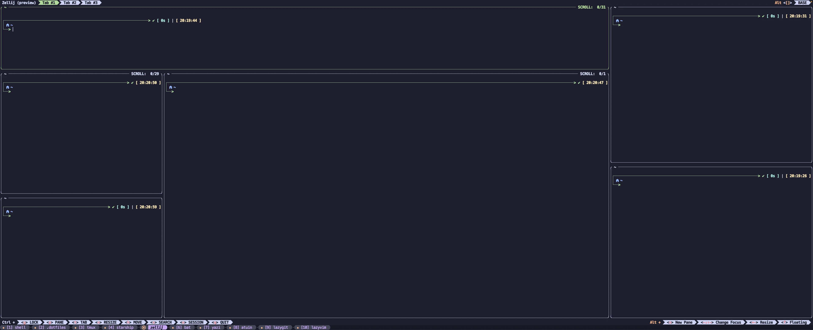
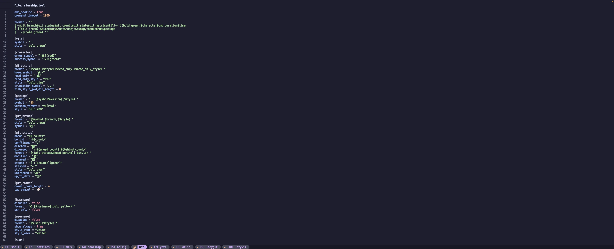
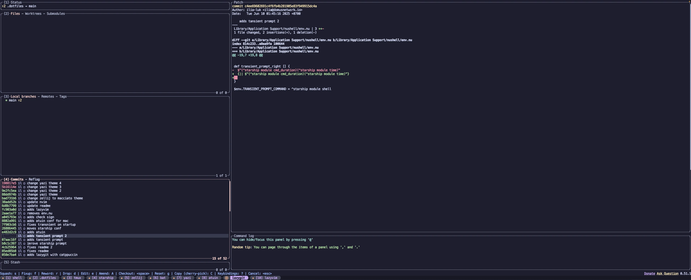

<h3 align="center">
	.dotfiles for the macOS CLI ninja
</h3>

<p align="center">
  
</p>

A modern macOS terminal environment that includes:

- Flavored all around with the `catppuccin` theme (which is objectively the best theme ever created).
- Utilizing `GNU stow` to symlink configurations.
- Custom `sync-dotfiles` script for easy updates.
- Using `nushell` as a shell.
- Using `kitty` as a terminal with `catppuccin` and custom tabs.
- Custom `starship` configuration with `catppuccin` and extras.
- Custom `tmux` configuration with `catppuccin` and extras.
- Configured `zellij` with `catppuccin`.
- Configured `yazi` with `catppuccin`.
- Configured `bat` with `catppuccin`.
- Configured `lazygit` with `catppuccin`.

## Previews

<details>
<summary>🚀 Kitty + Nushell + Starship</summary>

</details>
<details>
<summary>📚 Zellij</summary>

</details>
<details>
<summary>🗄️ Tmux</summary>

</details>
<details>
<summary>🦇 Bat</summary>

</details>
<details>
<summary>🗂️ Yazi</summary>

</details>
<details>
<summary>🧮 Lazygit</summary>

</details>

## Installation

### Dependencies

Install brew dependencies and fonts from --cask

```bash
  brew install stow openssl cmake kitty fish  nushell carapace starship asdf bat bat-extras onefetch fastfetch bottom htop zellij yazi ffmpeg sevenzip jq poppler fd ripgrep fzf zoxide resvg imagemagick font-symbols-only-nerd-font gpg gawk tmux lazygit xh dua-cli mprocs
```

```bash
  brew install --cask font-fira-code-nerd-font

```

### Configure

step 1: create `~/.dotfiles` path on your machine by running the following

```bash
  mkdir ~/.dotfiles
```

step 2: clone this repository into `~/.dotfiles` path.

```bash
  git clone <repo-url> ~/.dotfiles
```

step 3: symlink all files (you might need to backup/remove existing config files)

```bash
 stow .
```

step 4: give execute permissions for `sync-dotfiles` script

```bash
  chmod +x ~/bin/sync-dotfiles
```

### Updating configs

Make any changes in `~/.dotfiles` configs and run the following to sync the system (try it even with no changes)

```bash
  sync-dotfiles
```

### Make nushell the default macOS shell

step 1: add nu to /etc/shells

```bash
  sudo sh -c 'echo | which nu >> /etc/shells'
```

step 2: make sure you are inside nu shell.

```bash
  nu
```

step 3: define nu as default shell

```nu
  chsh -s (which nu | get path | first)
```

step 4: close current terminal and re/open kitty.

### Change default editor

step: 1: In `Library/Application Support/nushell/config.nu` change the following to the editor of your choice

```nu
  $env.EDITOR = 'nvim'
```

step 2: Run `sync-dotfiles`.

step 3: reopen kitty.

### NodeJS and Python version manager installation

step 1: run the following in a shell to install the NodeJS plugin

```nu
  asdf plugin add nodejs https://github.com/asdf-vm/asdf-nodejs.git
```

step 2: install a NodeJS latest version (or specific one using `asdf list all nodejs` and then changing `latest` to version number, current is `24.1.0`)

```nu
  asdf install nodejs latest
```

step 3: run the following in a shell to install the Python plugin

```nu
  asdf plugin add python
```

step 4: install a Python latest version (or specific one using `asdf list all python` and then changing `latest` to version number, current is `3.13.3t`)

```nu
  asdf install python latest
```

step 5: change `.tool-version` to include the versions you selected to serve as global versions

### Enable catppuccin for bat and bat-extras

enable catppuccin bat theme

```nu
  bat cache --build
```

## References

- Theme: [catppuccin](https://catppuccin.com/)
- Configuration symlinking: [stow](https://www.gnu.org/software/stow/)
- Terminal: [kitty](https://sw.kovidgoyal.net/kitty/)
- Shell: [nushell](https://www.nushell.sh/)
- Prompt: [starship](https://starship.rs/)
- Version manager: [asdf](https://asdf-vm.com/)
- Syntax highlighted `cat`: [bat](http://github.com/sharkdp/bat)
- `bat` for everything: [bat-extras](https://github.com/eth-p/bat-extras)
- Graphical process viewer: [bottom](https://github.com/ClementTsang/bottom)
- Fast process viewer: [htop](https://htop.dev/)
- Terminal multiplexer: [tmux](https://github.com/tmux/tmux/wiki)
- Workspaces: [zellij](https://zellij.dev/)
- File manager: [yazi](https://yazi-rs.github.io/)
- List files: [fd](https://github.com/sharkdp/fd)
- Search files: [ripgrep](https://github.com/BurntSushi/ripgrep)
- Navigation: [zoxide](https://github.com/ajeetdsouza/zoxide)
- Git TUI: [lazygit](https://github.com/jesseduffield/lazygit)
- Http: [xh](https://github.com/ducaale/xh)
- Disk usage: [dua-cli](https://github.com/Byron/dua-cli)
- Multipe process manager: [mprocs](https://github.com/pvolok/mprocs)
- Font(FiraCode): [nerd-fonts](https://www.nerdfonts.com/)
- Git info: [onefetch](https://github.com/o2sh/onefetch)
- System info: [fastfetch](https://github.com/fastfetch-cli/fastfetch)
